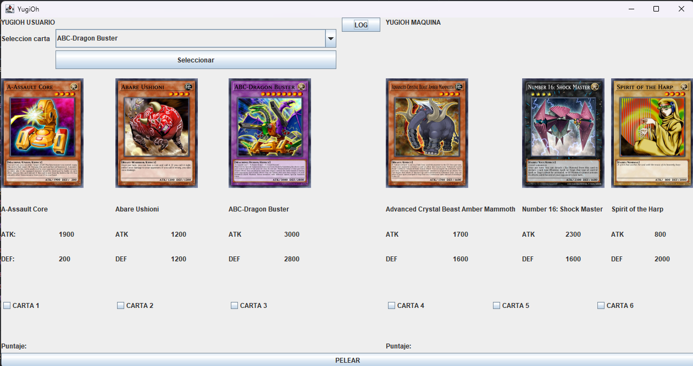
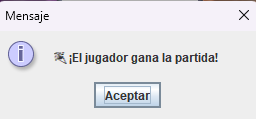
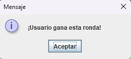
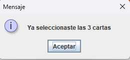
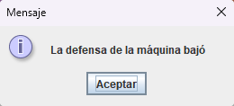
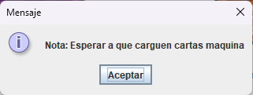
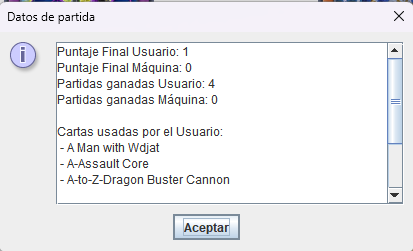

# 🃏 Guía rápida para ejecutar el proyecto *YugiOh-DS3* en IntelliJ IDEA

**Autores:**  
ANDERSON GOMEZ GARCIA – 2266242-3743  
JOHAN SEBASTIAN LAVERDE PINEDA – 2266278-3743

---

## ⚙️ Requisitos
- IntelliJ IDEA (Community o Ultimate)
- Java 17+ configurado como SDK

---

## 🚀 Ejecución
1. **Clonar:**  
   `git clone https://github.com/johanpineda10/YugiOh-DS3.git`
2. **Abrir:** *File → Open...* → seleccionar carpeta `YugiOh-DS3`
3. **Configurar SDK:** *File → Project Structure → SDK → Java 17+* 
4. **Configurar JSON:** *File → Project Structure → Project → Libraries → Add json.jar+*
4. **Compilar:** *Build → Build Project* (`Ctrl + F9`)
5. **Ejecutar:** abrir `src/View/YugiOhGui.java` → clic en ▶️ *Run main()*

---

## 💻 Interfaz principal
- **👤 Jugador:** muestra cartas, botones de acción y estado de vida.
- **🤖 Máquina:** panel espejo para el oponente controlado por IA.
- **⚔️ Campo de duelo:** zona central donde se enfrentan las cartas.
- **🃏 Botones inferiores:** iniciar duelo, reiniciar partida, salir.

---

## 🧩 Errores comunes
| Error | Solución |
|-------|-----------|
| `form-bindings: Class to bind does not exist` | Abrir `.form` y verificar que la clase `YugiOhGui` esté enlazada |
| `No SDK specified` | Asignar Java 17 en *Project SDK* |
| `Cannot find symbol` | Ejecutar *Build → Rebuild Project* |
| Ventana no abre | Asegurar que el `main()` esté en `YugiOhGui.java` |
| Colores o fuentes incorrectas | Limpiar caché: *File → Invalidate Caches / Restart* |

---

## 🎮 Uso de la interfaz

- **Seleccionar cartas:** elige **3 cartas** en el combo `nameCarta` → pulsa **Seleccionar** cada vez.
- Las cartas aparecen en tus **slots (1, 2 y 3)**.
- Al completar tus 3 cartas, **espera unos segundos** mientras la **Máquina selecciona las suyas automáticamente** ⚙️🤖.

- **Ver datos:** cada carta muestra su **imagen**, **nombre**, **ATK** y **DEF**.

- **Elegir para pelear:** selecciona **1 checkbox tuyo** y **1 del oponente** → pulsa **PELEAR**.
- El sistema **compara ATK y DEF**, actualiza valores y desactiva las cartas derrotadas.
- **Gana quien obtenga 2 victorias**, luego el sistema **reinicia la partida**.

- **Ver registro:** el botón **LOG** muestra los **puntajes**, **partidas ganadas** y **cartas usadas**.

- **Estados visuales:** los **checkboxes** se muestran solo cuando hay cartas asignadas; se **deshabilitan** al perder.

- **Errores API:** si falla la conexión al servidor, aparece un aviso y no se cargan las cartas.

- **Reinicio manual:** cerrar y volver a ejecutar el programa **reinicia todo**.

---

Capturas de pantalla:

